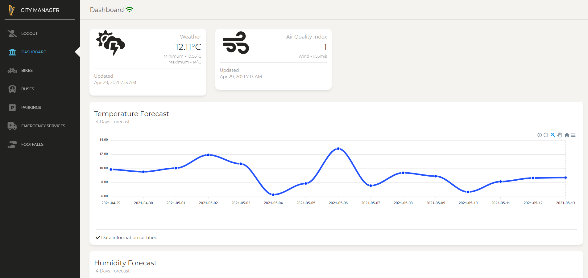
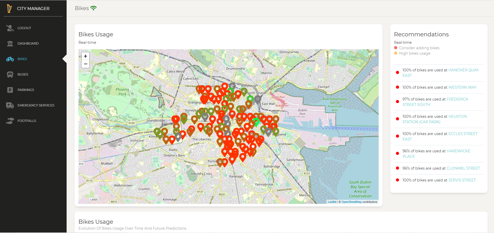
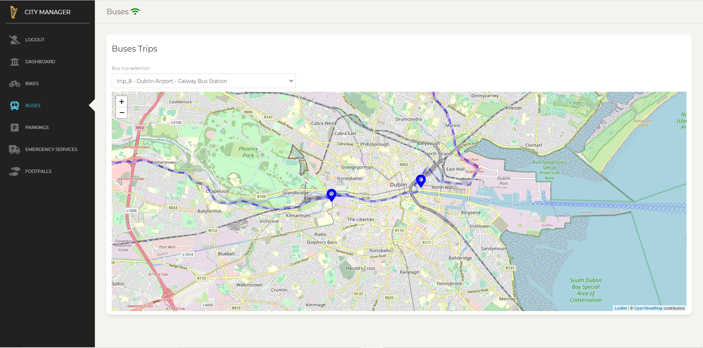
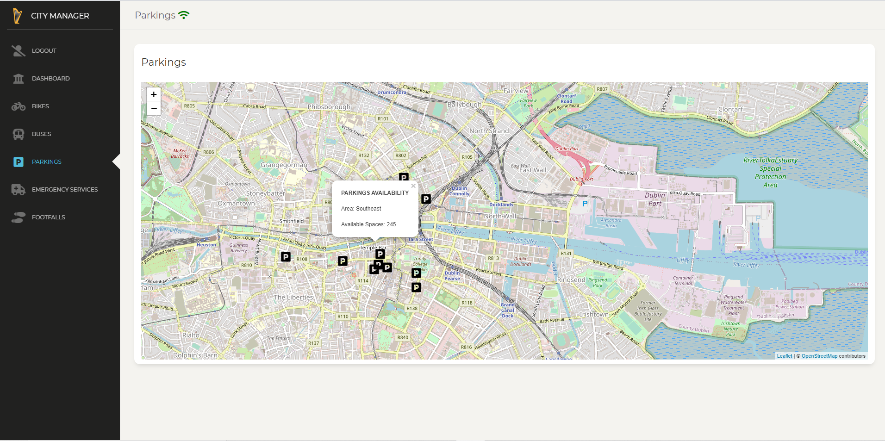
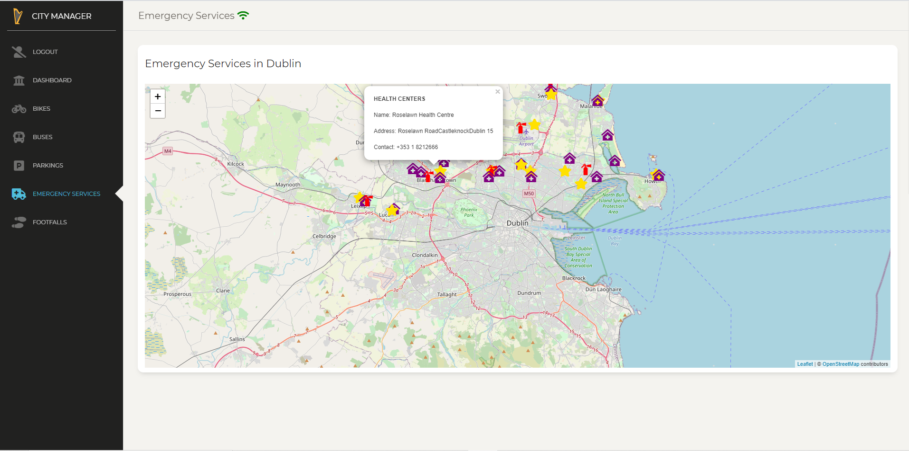
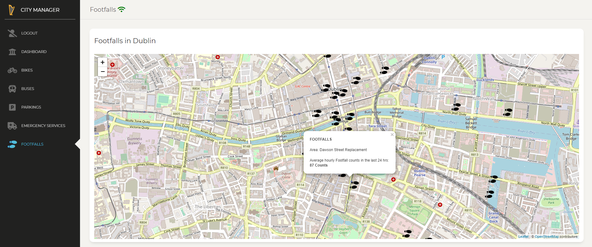

# Sustainable City Management

# Overview

This is an interesting project that we assigned to complete as a part of course module Advance Software Engineering. The aim of this project was to develop a dashboard based website covering all major functionalites of a city manager in his dialy routine work. So that, the city manager can collect, analyze and make decision based on the data displayed on the dashboard developed.    

# Pre-requisite Steps:

Clone the Gitlab repository:
```
git clone https://gitlab.scss.tcd.ie/fleschb/sustainable-city-management.git
cd sustainable-city-management/sustainableCityManagement
pip install -r requirements.txt
```
The project has been tested with Python >= 3.6.
Requires Node minimum version of 14.15.4 (LTS).

## Quick start

Quick start options:

- From the project folder, navigate to folder sustainableCityManagement.
- run `python manage.py runserver --noreload` [To run the backend server]
- From the project folder, navigate to folder frontend-pwa.
- run `yarn install`
- run `yarn start` [To run the frontend development server]

# Sustainable City Management - Front End


The above inserted video gives a glimpse of our user interface dashboard developed for the completeion of Sustainable City Management Project. We made use of Paper Dashboard React which is a Bootstrap Admin Panel which combines soft colours with beautiful typography and spacious cards and graphics.

**Bootstrap 4 Support** Paper Dashboard React is built on top of the much awaited Bootstrap 4 and uses the most used react framework that implements the Bootstrap 4 components on react, reactstrap.  This made the layout responsive, so that it can adapt to all variations of screen resolution. 

**Example Pages** Our built dashboard main page consist of child pages corresponding to every functionality that we covered.
These functionality include,
1. Bike usage: This page provide informations regarding current bike usage at various bike stands in Dublin city. In addition, it provides recommendation and predictions for bike usage in upcoming days.
2. Bus info: This page provides bus timing and route informations on google maps.
3. Parkings: This page provides parking information like available spaces on google maps.
4. Emergency Services: This page provides the location and contact information of various public services like, Health Care, Garda, Fire Services and Hospitals on google maps.
5. Footfalls: This page provides live information of footfalls recorded over major crossing in the city of Dublin.    
6. Dashboard: This gives information like temperature forecast, humidity forecast and population corelation data. 

## Table of Contents

* [Versions](#versions)
* [Demo](#demo)
* [Documentation Front_End](#documentation-frontend)
* [File Structure Front_End](#file-structure-frontend)
* [Browser Support](#browser-support)
* [Useful Links Front_End](#useful-links-frontend)


## Versions

|Application Version | 
| --- |
| [] Version :1.0 |

| HTML Used Version | React Used Version |
| --- | --- |
| [](https://www.creative-tim.com/product/paper-dashboard-2) | [](https://www.creative-tim.com/product/paper-dashboard-react) |

## Demo

| Dashboard | Bikes | Buses  | Parkings | Emergency Services | Footfalls |
| --- | --- | --- | --- | --- | --- |
| []() | []() | []() | []() | []() |  []() |

[View More(Live Demo)](https://)


## Documentation Front-end
The documentation for the project is available at Google Drive [Link](https://drive.google.com/drive/folders/1I2l6W3_I7wzpv2OcQOL-1KvZzZpxgOUw?usp=sharing).


## File Structure Front-end

Within the download you'll find the following directories and files with frontend-pwa folder:

```
├── CHANGELOG.md
├── ISSUE_TEMPLATE.md
├── LICENSE.md
├── README.md
├── jsconfig.json
├── package.json
├── docs
│   └── documentation.html
├── public
│   ├── favicon.ico
│   ├── index.html
│   └── manifest.json
 |     |___ robot.txt
└── src
    ├── index.js
    ├── logo-white.svg
    ├── logo.svg
    ├── routes.js
     |___ service-worker.js
     |___ serviceWorkerRegistration.js
     |___ setupTests.js
    ├── components
    │   ├── FixedPlugin
    │   │   └── FixedPlugin.jsx
    │   ├── Footer
    │   │   └── Footer.jsx
    │   ├── Navbars
    │   │   └── DemoNavbar.jsx
    │   └── Sidebar
    │       └── Sidebar.jsx
    ├── layouts
    │   └── Admin.jsx
    ├── variables
    │   ├── charts.jsx
    │   ├── general.jsx
    │   └── icons.jsx
    ├── views
    │   ├── Dashboard.jsx
    │   ├── Bikes.jsx
    │   ├── Bikes.test.jsx
    │   ├── Buses.jsx
    │   ├── EmergencyServices.jsx
    │   ├── Footfalls.jsx
    │   ├── Icons.jsx
    │   └── Login.jsx
     |     |___ Map.jsx
     |     |___ Notifications.js
     |     |___ Parkings.js
     |     |___ Tables.js
     |     |___ User.js
    └── assets
        ├── css
        │   ├── paper-dashboard.css
        │   ├── paper-dashboard.css.map
        │   └── paper-dashboard.min.css
        ├── demo
        ├── fonts
        ├── github
        ├── img
        │   └── faces
        └── scss
            ├── paper-dashboard
            │   ├── cards
            │   ├── mixins
            │   ├── plugins
            │   └── react
            │       ├── custom
            │       └── react-differences.scss
            └── paper-dashboard.scss
```

## Browser Support

At present, we officially aim to support the last two versions of the following browsers:

   

## Useful Links [Frontend]

Tutorials: <https://reactjs.org/>

# [Sustainable City Management - Back End]

- For backend we made use of Django environmental framework and for Database 'MongoDB"
- Install MongoDb for your respective OS version from product website [Link](https://docs.mongodb.com/manual/installation/).
- Now navigate to folder sustainableCityManagement by
    - cd sustainableCityManagement
- run 'pip install -r requirements.txt' to download all the required dependencies for backend'

## Table of Contents

* [Storage](#storage)
* [Restfull API Links and its usage](#API_Links)
* [Documentation Backend](#documentation-backend)
* [File Structure Backend](#file-structure-backend)
* [Test](#test)
* [Run Server](#server)
* [Useful Links Backend](#useful-links-backend)

## Storage

- To store the data one time on to the database server:
    - run  python manage.py runserver --noreload
    - Next we need to provided input 'Yes' for all storage related queries asked in the server.
    - This will create an instance on Mongo DB cluster under url: 127.0.01:27017
 
## Restfull API Links and its usage

- For Bike data:
    - Frontend URL: (http://localhost:3000/admin/bikes)
    - This will trigger four Get API function call at the backend:
        - Use  http://127.0.0.1:8000/main/bikestands_details/?type=historical&days_historic=5 for 5 day historical data.
        - Use  http://127.0.0.1:8000/main/bikestands_details/?type=locations for locations data.
        - Use http://127.0.0.1:8000/main/bikestands_graph/?location_based=no&days_historic=5 for getting the graph values (overall).
        - Use http://127.0.0.1:8000/main/bikestands_graph/?location_based=yes&days_historic=5 for getting the graph values (location based).

- For  Bus data:
    - Frontend URL: (http://localhost:3000/admin/buses)
    - This will trigger four Get API function call to the backend and third party service provider:
        - `https://api.openrouteservice.org/v2/directions/driving-hgv?api_key=${apiKey}&start=${start_destination&end=end_destination} for getting all possible bus routes.
        - http://127.0.0.1:8000/main/busstop_locations/ for getting all longitude and latitude locations for each bust stops
        - http://127.0.0.1:8000/main/busstop_timings/ for getting timings of each bus in a particular route.
        -  http://127.0.0.1:8000/main/bustrip_paths/ for getting paths for each bus trip from source to destination.

- For  Bashboard data:
    - Frontend URL: (http://localhost:3000/admin/dashboard)
    - This will trigger four Get API function call to the backend and third party service provider:
        - https://api.openweathermap.org/data/2.5/air_pollution?lat=53.3498&lon=-6.2603&appid=d50542e129f589c12a362e67f91906fe for getting air ppollution data for dublin city.
        - https://api.openweathermap.org/data/2.5/weather?q=Dublin&units=metric&appid=d50542e129f589c12a362e67f91906fe for getting weather data.
        - http://127.0.0.1:8000/mainweather_forecast/ for getting weather forecast for upcoming ten days. 
        -  http://127.0.0.1:8000/main/ireland_population/ for getting change in ireland population.

- For  Emergency data:
    - Frontend URL: (http://localhost:3000/admin/emergency)
    - This will trigger four Get API function call to the backend
        - Use  http://127.0.0.1:8000/main/health_centers/ for collecting health center location data.
        - Use  http://127.0.0.1:8000/main/garda_stations/ for collecting garda station information and location data.
        - Use  http://127.0.0.1:8000/main/hospital_centers/ for collecting hospital center information and location data.
        - Use  http://127.0.0.1:8000/main/fire_stations/ for collecting fire station basic information and location data.

- For  Parkings data:
    - Frontend URL: (http://localhost:3000/admin/parking)
    - This will trigger four Get API function call to the backend
        - Use  http://127.0.0.1:8000/main/parkings_availability/ for collecting available parking spaces within dublin city.
        - Use  http://127.0.0.1:8000/main/parks_parkings/ for collecting available parking spaces near parks.
        - Use  http://127.0.0.1:8000/main/beaches_parkings/ for collecting available parking spaces neae beaches.
        - Use  http://127.0.0.1:8000/main/playing_pitches_parkings/ for collecting available parking space near playing pitches.

- For  Parkings data:
    - Frontend URL: (http://localhost:3000/admin/footfalls)
    - This will trigger four Get API function call to the backend
        - Use  http://127.0.0.1:8000/main/footfall_overall/ for collecting live footfalls around major streets in dublin.
        - Use  http://127.0.0.1:8000footfall_datebased/?days_interval=6&location="name" for collecting predicted footfall for next six days.

## Documentation Backend

- The documentation for the project is available at Google Drive [Link](https://drive.google.com/drive/folders/1I2l6W3_I7wzpv2OcQOL-1KvZzZpxgOUw?usp=sharing).

## File Structure Backend

- Within the download you'll find the following directories and files with frontend-pwa folder:

```
├──db.sqlite3
├── Dockerfile
├── manage.py
├── Pipfile
├── requirements.txt
├── runserver_init.py
├── config
│   └── dev.env
       |____ prod.env
├── sustainableCityManagement
│   ├── settings.py
│   ├── urls.py
│   └── wsgi.py
└── main_project
    ├── Bike_API
    ├── Bus_API
    ├── Config
    ├── Emergency_Service_API
     |___ Footfall_API
     |___ Logs
     |___ migrations
    ├── ML_models
    │___ Parkings_API
    │___ Parkings_Recreational_Places_API
    │___ Population_API
    │___ Weather_api
    ├── tests
    │   ├── Bike_API
    │   ├── Bus_API
    │   ├── Emergency_Service_API
    │   ├── Footfall_API
    │   ├── ML_Models
    │   ├── Parkings_API
    │   ├── Parkings_Recreational_Places_API
    │   └── Population_API
     |     |___ __Init__.py
    └── sustainableCityManagement
        ├── __init__.py
        ├── settings.py
        ├── urls.py
        ├── wsgi.py
```
## Test
- To test the code and its functionality
    - run `python manage.py tests test`
    - It will run all the test cases created and output the results.

## Run Server
- cd sustainableCityManagement
- run  python manage.py runserver --noreload

## Useful Links Backend
Tutorials: <https://docs.djangoproject.com/en/3.2/>

